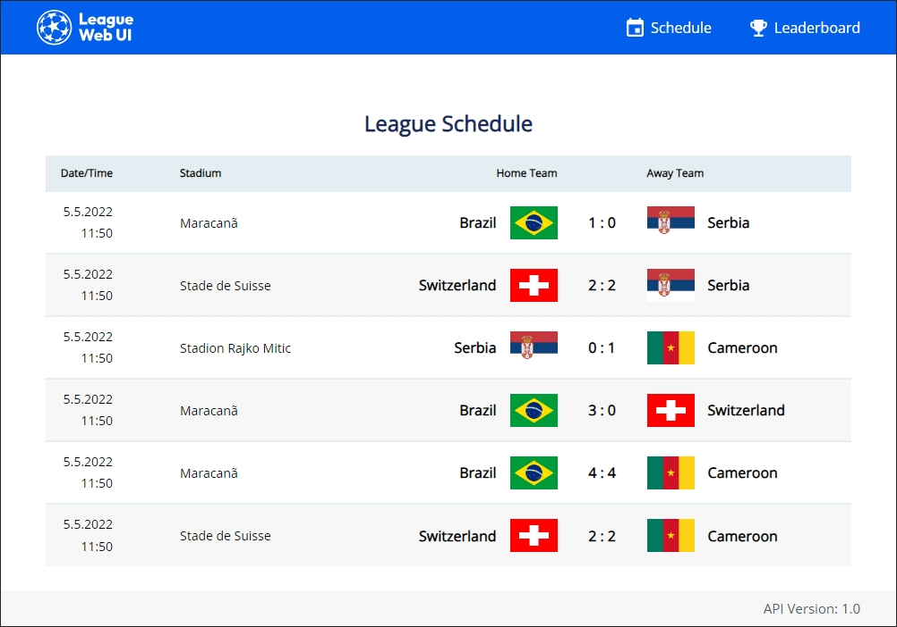
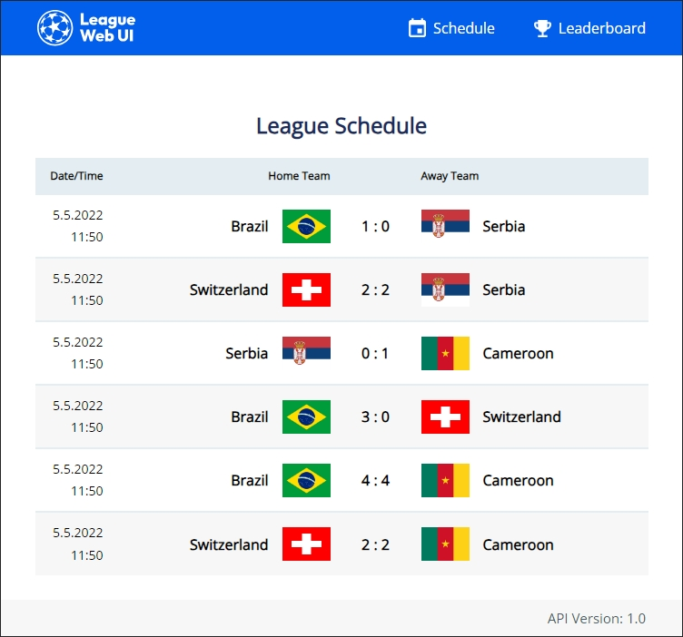
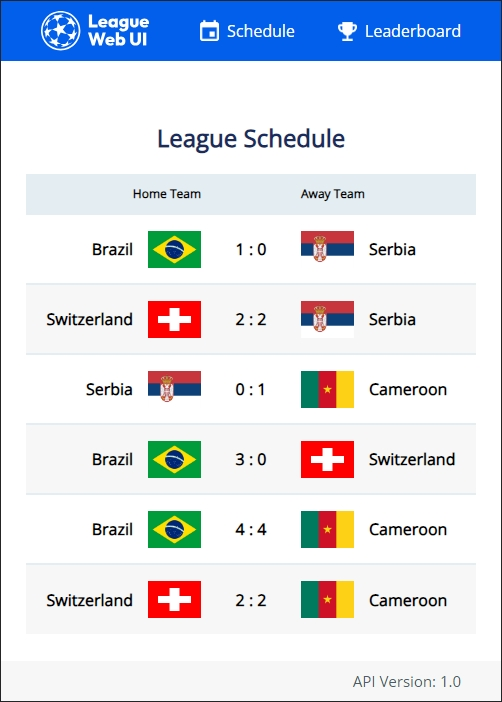
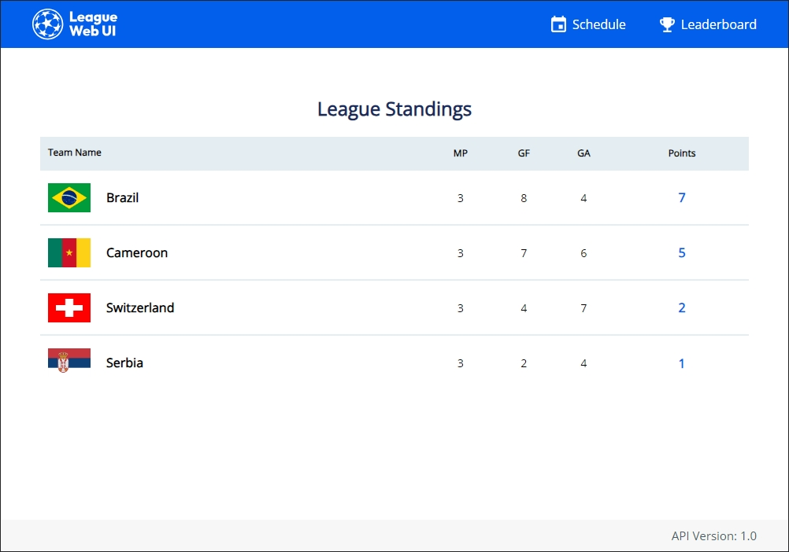
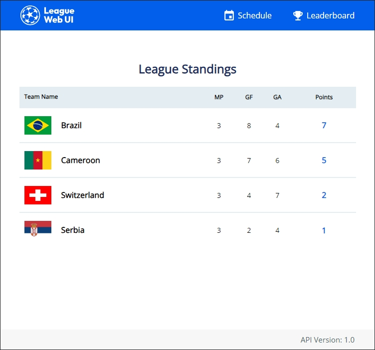
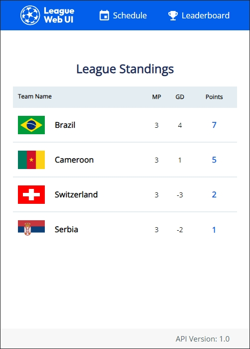

# Welcome to my Sport League UI Project! 

The goal of the project is to to create a SPA frontend to display a match schedule and tournament leaderboard with data from the backend API.
This site was built with:
- JSON backend API.
- React/Javascript frontend

The site has 2 main pages with a 404 Not Found page for any other URL. <br/>
The schedule page:
- Routed to ```http://localhost:3000/schedule``` or ```http://localhost:3000/  ```

The leaderboard page:
- Routed to ```http://localhost:3000/leaderboard  ```

Both the schedule and leaderboard page have a responsive layout, changing the table columns depending on the width of the page:<br/>

### Schedule Page

<br/>
 

<br/>

## Leaderboard Page

<br/>
 

<br/>

# Instructions to run the site locally:

### Step 1: Install Dependencies.

This solution requires NodeJs v16 installed.<br/>
To install project dependencies run:

> npm install

### Step 2: Run the Backend Mock Server

The site works with a local mock server that distributes the JSON responses for API version, Match data, and Match data secret token.
To run the mock server use:

> npx json-fake-server -m dev-mock-server-config.json

### Step 3: Running the site locally:

> **npm** start

This opens up http://localhost:3000 in your default browser and will display the schedule page.
